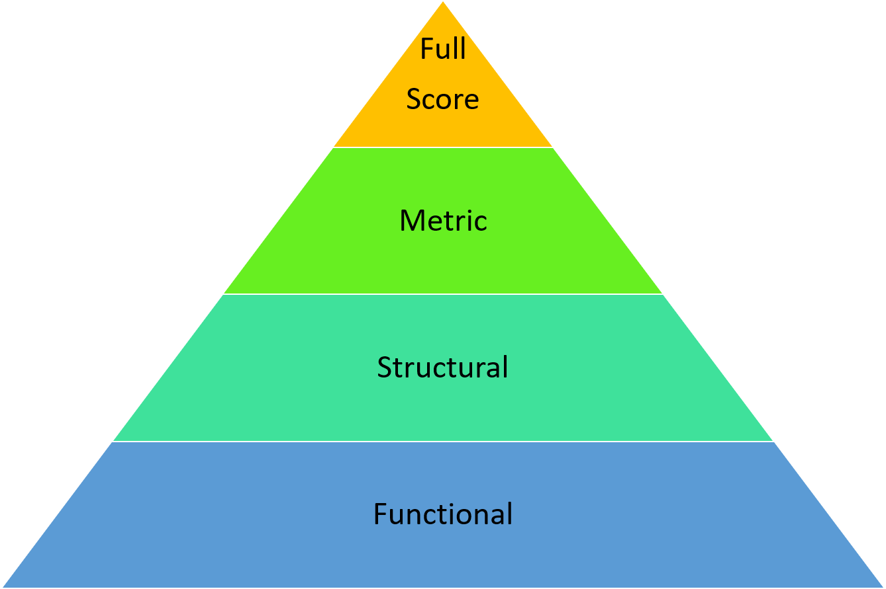

```{r loaddata, include = F}
data <- data
```
I am currently working on a project that aims to investigate the properties of a new psychological measure in different cultural samples. An often neglected aspect of this is equivalence testing (Vandenberge & Lance, 2000). Equivalence of measurement instruments is a necessary preconditon for many group comparisons. So what is equivalence? In the shortest (and probably most inaccurate way) we could describe measurment equivalence as:"". 
(Is there a difference between equivalence and invariance ?)
So what is the theory behind it and how can we test for it?

#Theory
If we want to understand the theory of measurement equivalence it is probably best to start with Meredith(1993). In the following I try to condense the article as much as possible. Meredith puts forward that a number ($p$) latent variables $W_p$ exist which are measured by a number ($n$) of observed indicators $X_n$. So in our case mindfulness, which is comprised from 5 factors and is measured by a number of questions for each factor. Meredith further states that we have a variable $V$ that represents a subpopulation from the parent population. In the case of  equivalence tests between cultures the parent population is humanity and the subpopulation are cultures. While Meredith mentions ethnicity, age, sex (which are all observable dimensions); he also mentions that $V$ could be a latent variable itself.
Meredith cites Mellenburgh (1989) expressing measurement invariance as:
$$F(x|w,v) = F(x|w)$$ 
What this basically indicates is that to achieve measurement invariance $v$ has no influence on the relation of the observed variable $x$ the relationship between $x$ and $w$, or $w$ itself. $F(x|w,v) = F(x|w)$ represents perfect measurement invariance. Meredith also defines weaker forms of measurement invariance.
 


#Application

For our current application we are starting with loading `library(psych)` and `library(lavaan)`. In this section I will show you two different ways of running an equivalence analysis in R, first manually and then the nice option.
So how do we test for equivalence manually.